STATISTICAL MODELS FOR HIGH DIMENSIONAL SCREENING OF GENETIC AND EPIGENETIC EFFECTS
========================================================
author: Kirk Gosik
date: 02/27/2017
css: custom.css
autosize: true
transition: fade
type: exclaim

 </img>

Background
========================================================
type: exclaim

<small>
- High Throughput Data 
  - Biotechnologies that continually create large scale and complex data
- Biological System
  - Use entire system when predicting a phenotype
  - Network of interaction effects
     - Gene-gene interactions
     - DNA Methylation Analysis
     - Gene-environment interactions
- Statistical Models and analysis are playing an increasing role in  mapping and identifying important quantitative trait loci and other genetic traits
</small>

Genotype-Phenotype Map
========================================================
type: exclaim

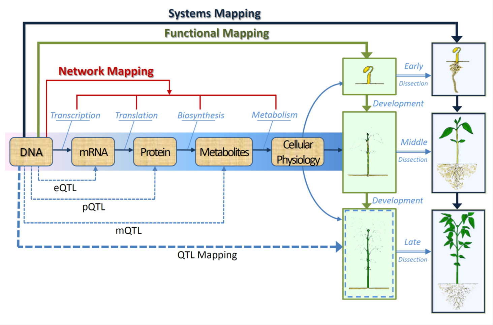 </img>
<footer>
Genotype-Phenotype mapping of various quantitative trait loci
</footer>

Experimental Design
========================================================
type: exclaim

<small>
Suppose that our data contains n progeny, each of which is genotyped by p markers, such as single nucleotide polymorphisms (SNPs), distributed over different chromosomes
</small>

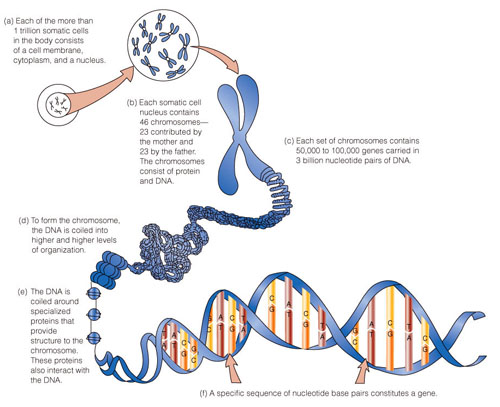 </img>

***

$$
\begin{equation}
Phenotype_i = \mathbf{SNP_i}^T\beta_j + \epsilon_i \\
for~j~in~1,\dots,p
\end{equation}
$$
 
Where $~\beta_j~$ are the genetic/epistatic effects  
 
$$
\epsilon_i \sim N(0, \sigma^2)
$$  

Important Considerations 
========================================================
type: exclaim
incremental: true

 Consider all SNPs at once as possible QTLs (p >> n)  

Screening is predominantly used to quickly reduce the dimensionality. We would need a relatively efficient computational procedure and the resulting model should posses sure screening properties under reasonable assumptions
<small>
 - Including order-2 epistatic effects increases to ${{p}\choose{2}}+p=\frac{p^2+p}{2}$
  - p = 500, gives 125,250 possible candidate SNPs and epistatic effects
 - Including order-3 epistatic effects increases to ${{p}\choose{3}}+{{p}\choose{2}}+p=\frac{p^3+5p}{6}$
  - p = 500 gives 20,833,750 possible candidate SNPs and epistatic effects
</small>

Variable Selection
========================================================
type: exclaim

<h4> Variable selection is usually implemented in order to handle the high dimensionality of the data.  Many techniques exist including, </h3>

 - LASSO
 - SCAD
 - Elasticnet
 - Dantzig selector 
 
<h4> Interaction selection Methods </h3>
 - Glinternet <small>(Lim and Hastie 2014)</small>
 - HierNet <small>(Bien et al 2013)</small>

Notation
========================================================
type: exclaim

$\mathcal{P_1}$ - main effects predictors  
$\mathcal{P_2}$ - interaction effects predictors  
$\mathcal{M}$ -  Model Set  
$\mathcal{C}$ -  Candidate Set  
$\mathcal{S}$ -  Solution Set  

$\mathcal{T}$ - True Model  
$\mathcal{F}$ - The Full Model

Forward Regression Method
========================================================
type: exclaim

<small>
Algorithm 
 - Step 1: (Initialization) Set $\mathcal{S}^{(0)} = \emptyset$
 - Step 2: (Forward Regression)
   - Evaluation. In the kth step (k ≥ 1), we are given $S^{(k−1)}$. 
    Then, for every $j \in \mathcal{F}/S^{(k−1)}$, we construct a
    candidate model $\mathcal{M}^{(k−1)} = \mathcal{S}^{(k-1)} \cup j$. 
    We then compute $RSS^{(k−1)}$
    - Screen. We then find $a_k = argmin(RSS_{j}^{(k-1)})$ and update 
    $\mathcal{S}^{(k)}=\mathcal{S}^{(k-1)} \cup {a_k}$ accordingly.
 - Step 3: (Solution Path). Iterating Step for n times, which leads to a total of n nested candidate models.  We then collect those models by a solution path $\mathbb{S} = \{\mathcal{S}^{(k)}: 1 \le k \le n\}$
</small>    

Forward Regression Method
========================================================
type: exclaim

<small>
Assumptions for standard technical conditions needed to show screening consistency of forward regression (Wang 2012)
 - (C1) Normality assumption.  Assume that both X and $\epsilon$ follow normal distributions.
 - (C2) Covariance matrix: $\lambda_{min}(\mathbf{A})~and~\lambda_{max}(\mathbf{A})$ represent, respectively the smallest and largest eigenvalues of an arbitrary positive definite matrix $\Sigma$.  We assume that there exist two positive constants $0 \lt \tau_{min} \lt \tau_{max} \lt \infty$, such that $2\tau_{min} \lt \lambda_{min}(\Sigma) \lt \lambda_{max}(\Sigma) \lt \frac{1}{2}\tau_{max}$
 - (C3) Regression coefficients.  We assume that $||\beta|| \le \mathcal{C_{\beta}}$ for some constant $\mathcal{C_{\beta}} \gt 0$ and $\beta_{min} \ge \nu_{\beta}n^{\xi_{min}}$ for some $\xi_{min} \gt 0$
 - (C4) Divergence speed of d and $d_0$.  There exists constants 
 $\xi$, $\xi_0$, and $\nu$ such that $log(d) \le \nu n^{\xi_{0}}$, and $\xi + 6\xi_0 + 12\xi_{min} \lt 1$.
</small>
 
<footer>
[(order2)](#/13)
[(order3)](#/14)
</footer>

Screening Consistency
========================================================
type: exclaim

<small>
Unrealistic to require $\mathcal{T} \in \mathcal{S}$
 - Not guaranteed even in the fixed dimension situation  

It is possible to have $\mathcal{T} \subset \mathcal{S}^{(k)}$ for some 1 ≤ k ≤ n  
 - Otherwise, there exists at least one relevant predictor completely missed by the solution path $\mathcal{S}$ 

The solution path $\mathcal{S}$ is said to be screening consistent, if  
$$P(\mathcal{T} \subset \mathcal{S}^{(k)} \in \mathcal{S}~for~some~1 \le k \le n) \rightarrow 1$$

Defining $K = 2\tau_{max} \nu C_{\beta}^2\tau_{min}^{-2}\nu_{\beta}^{-4}$ Under conditions (C1) - (C4), we have as $n \rightarrow \infty$
$$P(\mathcal{T} \subset \mathcal{S}^{([K \nu n^{2\xi_0 + 4\xi_{min}}])}) \rightarrow 1$$

within
$O(n^{2\xi_0 + 4\xi_{min}})$ steps which is much smaller than the samples size, n under (C4). (Wang 2012)
</small> 

Genetic Interactions
========================================================
type: exclaim

<small>
 - Referred to as epistatic interactions, they contribute to many complex traits  
 - Relatively little is known about the specific forms of genetic interactions that are important to heritable phenotypic variation
 - Mainly reported genetic interactions involving only two loci
 - Emphasis on gene–gene interactions over higher-order genetic interactions (HGIs) involving three or more loci is rooted in technical issues, rather than biology (Taylor and Ehrenreich 2014)
</small>

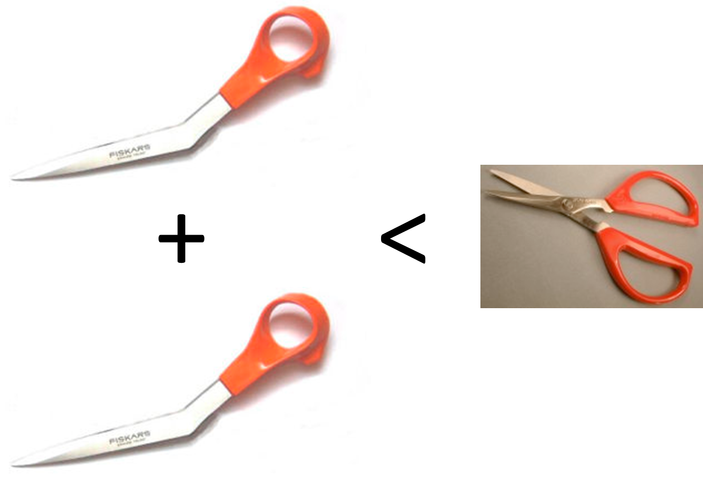 </img>
<footer>
Epistatic Effects Work Like Scissors
</footer>

Marginality Principle
========================================================
type: exclaim

It is inappropriate to model interaction terms when the main effects contributing to the interaction have either not been included or were deleted because the effects became marginal by the inclusion of the interaction effect

 - Implicit in Forward Selection Procedures 
 - SNP effects will not be removed if it becomes insignificant by inclusion of epistatic effects later on

 
Heredity Principle
========================================================
type: exclaim

Strong Condition:
$\beta_{jk} \ne 0 \implies \beta_j, \beta_k \ne 0$

Weak Condition:
$\beta_{jk} \ne 0 \implies \beta_{j}^2+\beta_{k}^2 \ne 0$

 - Statistical efficiency
 - Computational efficient
 - Cost Effective

Interaction Model
========================================================
type: exclaim

$$\mathbf{Y} = \mathbf{X^T}\beta^{(1)} + \mathbf{Z^T}\beta^{(2)} + \epsilon$$

Updated Assumptions 
 - $X_i$ and $X_jX_k$ are marginally and jointly normal
 - (C2a) There exists two constants $0 \lt \tau_{min} \lt \frac{1}{4} \lt 1 \lt \tau_{max} \lt \infty~$ s.t $\sqrt{\tau_{min}} \lt \lambda_{min}(\Sigma_{(1)}) \lt \lambda_{max}(\Sigma_{(1)}) \lt \sqrt{\tau_{max}/4}$
 - (C4a) There exists constants $\xi$, $\xi_0$, and $\nu$ such that $log(p) \le \nu n^{\xi_{0}}$, and $\xi + 6\xi_0 + 12\xi_{min} \lt \frac{1}{2}$

<footer>
[(Original)](#/8)
</footer>

Higher-Order Interaction Model
========================================================
type: exclaim

$$\mathbf{Y} = \mathbf{X^T}\beta^{(1)} + \mathbf{Z^T}\beta^{(2)} + \mathbf{W^T}\beta^{(3)} + \epsilon$$

Updated Assumptions
 - $X_i$, $X_jX_k$ and $X_jX_kX_l$ are marginally and jointly normal
 - (C2b) There exists two constants $0 \lt \tau_{min} \lt \frac{1}{4} \lt 1 \lt \tau_{max} \lt \infty~$ s.t $\sqrt{\tau_{min}} \lt \lambda_{min}(\Sigma_{(1)}) \lt \lambda_{max}(\Sigma_{(1)}) \lt \sqrt{\tau_{max}/8}$
 - (C4b) There exists constants $\xi$, $\xi_0$, and $\nu$ such that $log(p) \le \nu n^{\xi_{0}}$, and $\xi + 6\xi_0 + 12\xi_{min} \lt \frac{1}{4}$
 
<footer>
[(Original)](#/8)
</footer>

 
iForm Algorithm
========================================================
type: exclaim

<small>
  - Step 1: (Initialization) 
  Set $\mathcal{S}^{(0)} = \emptyset$, $\mathcal{M}_0 = \emptyset$ and $\mathcal{C}_0 = \mathcal{P_1}$
  - Step 2: (Selection) In the kth step with given $\mathcal{S}^{(k-1)}$, $\mathcal{C}^{k−1}$ and $\mathcal{M}^{k−1}$, [forward regression](#/7) is used to select one more predictor from $\mathcal{C}^{k−1}/ \mathcal{S}^{k−1}$ into the model. We add the selected one into $\mathcal{S}^{k−1}$ to get $\mathcal{S}^k$. We also update $\mathcal{C}^k$ and $\mathcal{M}^k$ if the newly selected predictor is a main effect. Otherwise, $\mathcal{C}^k = \mathcal{C}^{k−1}$ and $\mathcal{M}^k = \mathcal{M}^{k−1}$
  - Step 3: (Solution Path). Iterating Step 2, for D times, which leads to a total of D nested candidate models.  We then collect those models by a solution path $\mathbb{S}=\{\mathcal{S}^{(k)}: 1 \le k \le D\}$
</small>

Model Properties
========================================================
type: exclaim

Computational complexity is O(mn) with n being the sample size and m being the number of predictors in the candidate set at that iteration of the procedure, 
 - order-2 $m \le p+n(n+1)~$ for any step.  Making it $O(n^2p+n^4)$
 - order-3 $m \le p+n(n^2-3n+8)~$ for any step. Making it $O(n^2p+n^5-3n^4+8n^3)$

Therefore the complexity grows linearly with p

False Discovery Rate
========================================================
type: exclaim

$$BIC = n*log(RSS/n) + k*log(n)$$  
$$BIC_2 = n*log(RSS/n) + k*(log(n) + 2*log(d^{\star}))$$

 - Derived $BIC_2$ by controlling the false discovery rate (FDR)
 - Showed that it is selection consistent if $d_0 = O(n^{\xi})$ for some $\xi > 0$
 - Wang (2009) showed its selection consistency for FS under ultra-high dimensional setup $d_0 = O(e^{n^{\xi}})$

Simulation Studies
========================================================
type: exclaim

 - Simulations were performed to compare model properties
 - Data was generated from higher-order genetic interaction model
 - 500 predictors were generated with a sample size of 300 observations
 - The data was split into training and a testing set 

 
<small>
4 Scenarios  
 - Truth obeys strong heredity
 - Truth obeys weak heredity
 - Truth follows anti-heredity
 - Truth is from pure interaction effects
</small>

Simulation (truth obeys strong heredity)
========================================================
type: exclaim

<small>

|Model                |T1_tpr |T1_fpr |T2_tpr |T2_fpr |T3_tpr |T3_fpr | Train_MSE| Train_Rsq| Test_MSE| Test_Rsq|RunTime |
|:--------------------|:------|:------|:------|:------|:------|:------|---------:|---------:|--------:|--------:|:-------|
|forward_select       |1.000  |0.001  |NA     |NA     |NA     |NA     |     3.330|     0.727|    3.490|    0.711|0.757   |
|iform_order_2_weak   |1.000  |0.000  |0.000  |0.000  |NA     |NA     |     1.128|     0.907|    1.252|    0.895|5.896   |
|iform_order_2_strong |1.000  |0.000  |0.000  |0.000  |NA     |NA     |     1.102|     0.909|    1.198|    0.900|1.557   |
|forward_select_2     |1.000  |0.000  |0.000  |0.000  |NA     |NA     |     1.086|     0.910|    1.198|    0.900|25.481  |
|forward_select_3     |1.000  |0.000  |0.000  |0.000  |0.000  |0.000  |     0.992|     0.918|    1.121|    0.906|471.881 |
|iform_order_3_weak   |1.000  |0.000  |0.000  |0.000  |0.000  |0.000  |     1.020|     0.916|    1.135|    0.905|11.346  |
|iform_order_3_strong |1.000  |0.000  |0.000  |0.000  |0.000  |0.000  |     0.968|     0.920|    1.060|    0.911|1.872   |
|glinternet           |1.000  |0.441  |1.000  |0.018  |0.000  |0.000  |     1.246|     0.898|    1.446|    0.880|208.167 |
|hierNet              |1.000  |0.303  |1.000  |0.024  |0.000  |0.000  |     0.906|     0.925|    1.421|    0.882|27.521  |
|Oracle               |NA     |NA     |NA     |NA     |NA     |NA     |     0.953|     0.921|    1.050|    0.912|NA      |
</small>

Simulation (truth obeys weak heredity)
========================================================
type: exclaim

<small>

|Model                |T1_tpr |T1_fpr |T2_tpr |T2_fpr |T3_tpr |T3_fpr | Train_MSE| Train_Rsq| Test_MSE| Test_Rsq|RunTime |
|:--------------------|:------|:------|:------|:------|:------|:------|---------:|---------:|--------:|--------:|:-------|
|forward_select       |1.000  |0.001  |NA     |NA     |NA     |NA     |     3.326|     0.731|    3.480|    0.716|4.355   |
|iform_order_2_weak   |1.000  |0.000  |0.000  |0.000  |NA     |NA     |     1.119|     0.910|    1.200|    0.901|8.342   |
|iform_order_2_strong |1.000  |0.008  |0.000  |0.000  |NA     |NA     |     1.580|     0.872|    1.707|    0.859|2.952   |
|forward_select_2     |1.000  |0.000  |0.000  |0.000  |NA     |NA     |     1.083|     0.912|    1.167|    0.904|38.872  |
|forward_select_3     |1.000  |0.000  |0.000  |0.000  |0.000  |0.000  |     0.979|     0.921|    1.089|    0.910|569.983 |
|iform_order_3_weak   |1.000  |0.000  |0.000  |0.000  |0.000  |0.000  |     1.003|     0.919|    1.079|    0.911|13.054  |
|iform_order_3_strong |1.000  |0.008  |0.000  |0.000  |0.000  |0.000  |     1.578|     0.872|    1.705|    0.859|2.787   |
|glinternet           |1.000  |0.531  |1.000  |0.020  |0.000  |0.000  |     0.906|     0.927|    1.425|    0.883|29.975  |
|hierNet              |1.000  |0.343  |1.000  |0.027  |0.000  |0.000  |     0.856|     0.931|    1.412|    0.884|33.302  |
|Oracle               |NA     |NA     |NA     |NA     |NA     |NA     |     0.940|     0.924|    1.034|    0.915|NA      |
</small>

Simulation (truth is anti-heredity)
========================================================
type: exclaim

<small>

|Model                |T1_tpr |T1_fpr |T2_tpr |T2_fpr |T3_tpr |T3_fpr | Train_MSE| Train_Rsq| Test_MSE| Test_Rsq|RunTime |
|:--------------------|:------|:------|:------|:------|:------|:------|---------:|---------:|--------:|--------:|:-------|
|forward_select       |1.000  |0.000  |NA     |NA     |NA     |NA     |     3.284|     0.729|    3.510|    0.714|1.005   |
|iform_order_2_weak   |1.000  |0.004  |0.000  |0.000  |NA     |NA     |     3.140|     0.741|    3.435|    0.719|7.866   |
|iform_order_2_strong |1.000  |0.000  |0.000  |0.000  |NA     |NA     |     3.284|     0.729|    3.510|    0.714|2.386   |
|forward_select_2     |1.000  |0.000  |0.000  |0.000  |NA     |NA     |     1.081|     0.911|    1.171|    0.904|29.095  |
|forward_select_3     |1.000  |0.000  |0.000  |0.000  |0.000  |0.000  |     0.989|     0.918|    1.095|    0.910|548.617 |
|iform_order_3_weak   |1.000  |0.003  |0.000  |0.000  |0.000  |0.000  |     3.155|     0.739|    3.448|    0.719|13.216  |
|iform_order_3_strong |1.000  |0.000  |0.000  |0.000  |0.000  |0.000  |     3.284|     0.729|    3.510|    0.714|2.703   |
|glinternet           |1.000  |0.710  |1.000  |0.029  |0.000  |0.000  |     0.844|     0.931|    1.578|    0.871|26.564  |
|hierNet              |1.000  |0.858  |1.000  |0.085  |0.000  |0.000  |     0.307|     0.975|    2.216|    0.819|3.417   |
|Oracle               |NA     |NA     |NA     |NA     |NA     |NA     |     0.952|     0.921|    1.031|    0.915|NA      |
</small>

Simulation (truth is constructed of pure interactions)
========================================================
type: exclaim

<small>

|Model                |T1_tpr |T1_fpr |T2_tpr |T2_fpr |T3_tpr |T3_fpr | Train_MSE| Train_Rsq| Test_MSE| Test_Rsq|RunTime |
|:--------------------|:------|:------|:------|:------|:------|:------|---------:|---------:|--------:|--------:|:-------|
|forward_select       |NA     |0.020  |NA     |NA     |NA     |NA     |     3.316|     0.025|    3.445|   -0.039|1.177   |
|iform_order_2_weak   |NA     |0.028  |0.000  |0.000  |NA     |NA     |     3.007|     0.115|    3.181|    0.040|5.840   |
|iform_order_2_strong |NA     |0.021  |0.000  |0.000  |NA     |NA     |     3.294|     0.031|    3.429|   -0.034|2.081   |
|forward_select_2     |NA     |0.000  |0.000  |0.000  |NA     |NA     |     1.117|     0.669|    1.170|    0.644|26.396  |
|forward_select_3     |NA     |0.000  |0.000  |0.000  |0.000  |0.000  |     1.004|     0.703|    1.081|    0.671|530.362 |
|iform_order_3_weak   |NA     |0.025  |0.000  |0.000  |0.000  |0.000  |     3.043|     0.106|    3.209|    0.032|9.461   |
|iform_order_3_strong |NA     |0.021  |0.000  |0.000  |0.000  |0.000  |     3.294|     0.031|    3.429|   -0.034|2.265   |
|glinternet           |NA     |0.571  |1.000  |0.017  |0.000  |0.000  |     1.002|     0.699|    1.445|    0.561|145.078 |
|hierNet              |NA     |0.853  |1.000  |0.045  |0.000  |0.000  |     0.672|     0.802|    1.758|    0.467|4.491   |
|Oracle               |NA     |NA     |NA     |NA     |NA     |NA     |     0.968|     0.713|    1.022|    0.689|NA      |
</small>

Application 1 (C Elegans)
========================================================
type: exclaim
<small>
To genetically dissect the causes of different variability among C. elegans traits, transcript abundances of 20,000 gene transcripts were measured by microarray in developmentally synchronized young adult hermaphrodites of 208 recombinant inbred  advanced intercross lines from a cross between the laboratory strain, N2, and a wild isolate from Hawaii, CB485618
 - Microarray data preprocessed through a normal–exponential convolution background correction and were normalized using quantile standardization  Rockman et al 2010
</small>

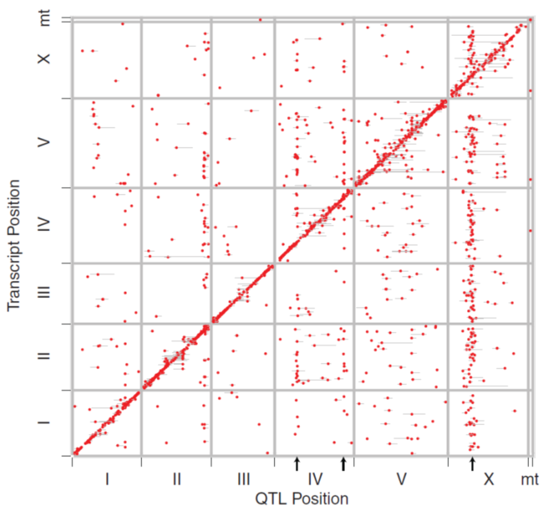 </img>

Application 1 (C Elegans)
========================================================
type: exclaim

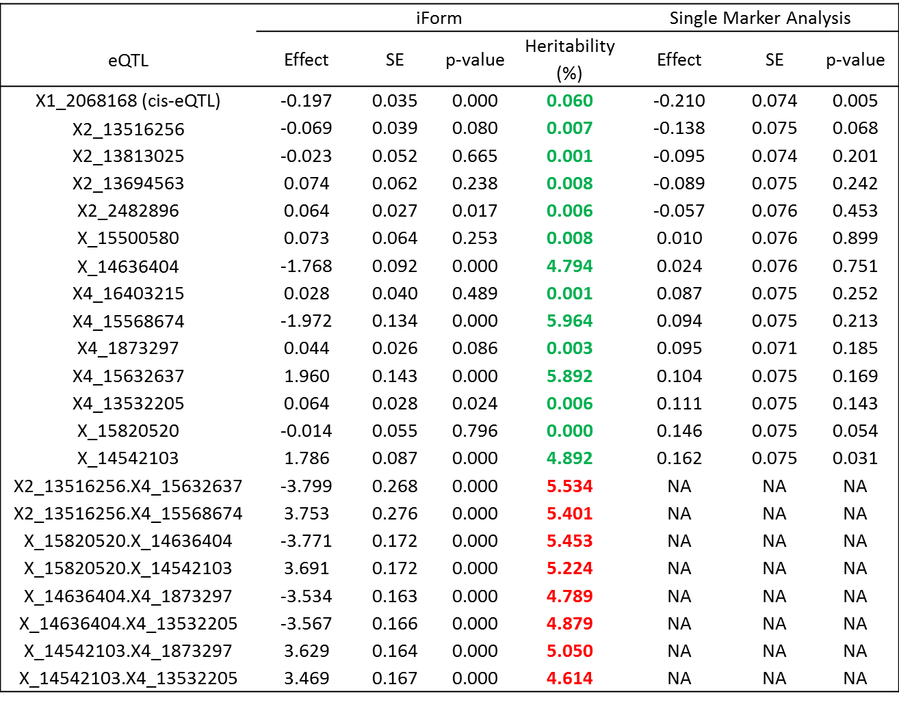 </img>
  
  A_12_P103290 on Chromosome 1

Application 1 (C Elegans)
========================================================
type: exclaim

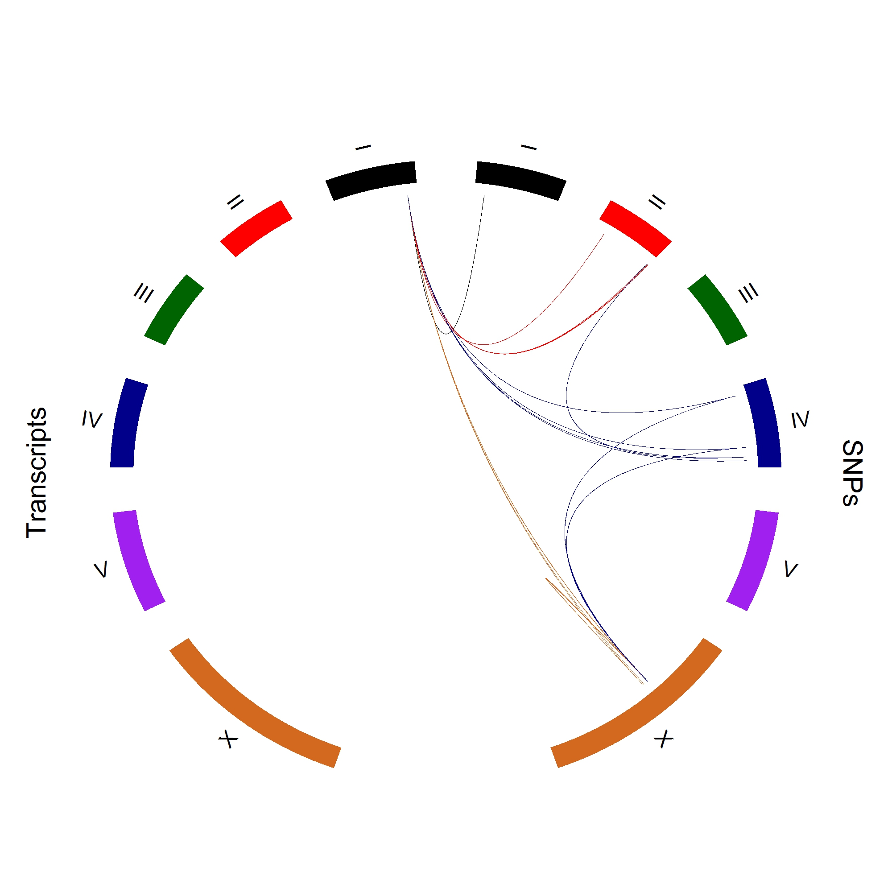</img>

Application 2 (Mei Trees)
========================================================
type: exclaim

 - 190 F1 hybrids derived from two different cultivars, Fenban x Kouzi Yudie
 - 1484 SNP markers over eight mei chromosomes
 - Shoot growth measured once every two weeks during an entire growth season from March to October
 - Fitness of growth equation $g(t)=a/(1+b*exp(-rt))$ obtaining the estimates of a, b, and r for each hybrid
 - Estimated growth parameters a, b, r as static phenotypes

Application 2 (Mei Trees)
========================================================
type: exclaim

<small>

|Coefficient                           | Estimate|     SE| T.value| P.value|
|:-------------------------------------|--------:|------:|-------:|-------:|
|(Intercept)                           |   0.1829| 0.0761|   2.402|  0.0174|
|AATTC_nn_np_2517_a                    |   0.4001| 0.0651|   6.147|  0.0000|
|AATTC_nn_np_2815_a                    |   0.1579| 0.0684|   2.310|  0.0221|
|CATG_nn_np_3479_a                     |   0.2343| 0.0528|   4.434|  0.0000|
|CATG_nn_np_1284_a                     |   0.2220| 0.0531|   4.179|  0.0000|
|AATTC_nn_np_2815_a×AATTC_lm_ll_3034_a |   0.4578| 0.0924|   4.953|  0.0000|
</small>

Application 2 (Mei Trees)
========================================================
type: exclaim
<small>

|Coefficient                                              | Estimate|     SE| T.value| P.value|
|:--------------------------------------------------------|--------:|------:|-------:|-------:|
|(Intercept)                                              |   0.1686| 0.0580|   2.906|  0.0042|
|AATTC_nn_np_2517_a                                       |   0.2777| 0.0440|   6.318|  0.0000|
|AATTC_nn_np_2815_a                                       |   0.2638| 0.0530|   4.983|  0.0000|
|CATG_nn_np_3479_a                                        |   0.2077| 0.0347|   5.990|  0.0000|
|CATG_nn_np_1284_a                                        |   0.0452| 0.0426|   1.060|  0.2905|
|AATTC_nn_np_2815_a×AATTC_lm_ll_3034_a                    |   1.8257| 0.1792|  10.185|  0.0000|
|AATTC_nn_np_2815_a×AATTC_hk_hk_278_a                     |   0.2594| 0.0389|   6.671|  0.0000|
|CATG_lm_ll_3153_a                                        |   0.1488| 0.0349|   4.262|  0.0000|
|CATG_nn_np_1284_a×AATTC_nn_np_554_a                      |   0.2299| 0.0510|   4.505|  0.0000|
|AATTC_nn_np_2815_a.AATTC_lm_ll_3034_a×AATTC_nn_np_1615_a |  -1.5171| 0.1906|  -7.960|  0.0000|
|AATTC_nn_np_2815_a×AATTC_nn_np_929_a                     |  -0.3080| 0.0548|  -5.624|  0.0000|
|AATTC_hk_hk_479_d                                        |   0.1604| 0.0344|   4.660|  0.0000|
|AATTC_nn_np_2517_a×CATG_hk_hk_648_a                      |   0.1454| 0.0284|   5.118|  0.0000|
</small>
 
<small>
[Functional Results](#/41)
</small>

Application 2 (Mei Trees)
========================================================
type: exclaim

<small>
$\alpha_1=AATTC\_nn\_np\_2815(AA/Aa)$   
$\alpha_2=AATTC\_lm\_ll\_3034(BB/Bb)$  
$\alpha_3=AATTC\_nn\_np\_1615(CC/Cc)$  
</small>

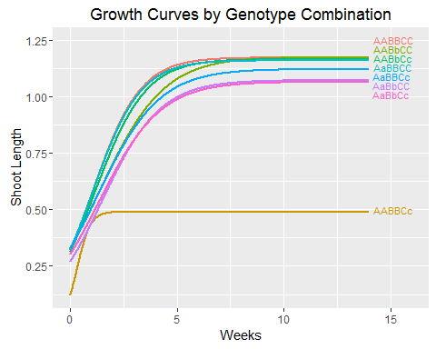</img>
  
$\mu_{111} = \mu(t) + \alpha_1(t) + \alpha_2(t) + \alpha_3(t) + i_{12}(t) + i_{13}(t) + i_{23}(t) + i_{123}(t)$
$\mu_{112} = \mu(t) + \alpha_1(t) + \alpha_2(t) - \alpha_3(t) + i_{12}(t) - i_{13}(t) - i_{23}(t) - i_{123}(t)$
$\mu_{121} = \mu(t) + \alpha_1(t) - \alpha_2(t) + \alpha_3(t) - i_{12}(t) + i_{13}(t) - i_{23}(t) - i_{123}(t)$
$\mu_{122} = \mu(t) + \alpha_1(t) - \alpha_2(t) - \alpha_3(t) - i_{12}(t) - i_{13}(t) + i_{23}(t) + i_{123}(t)$
$\mu_{211} = \mu(t) - \alpha_1(t) + \alpha_2(t) + \alpha_3(t) - i_{12}(t) - i_{13}(t) + i_{23}(t) - i_{123}(t)$
$\mu_{212} = \mu(t) - \alpha_1(t) + \alpha_2(t) - \alpha_3(t) - i_{12}(t) + i_{13}(t) - i_{23}(t) + i_{123}(t)$
$\mu_{221} = \mu(t) - \alpha_1(t) - \alpha_2(t) + \alpha_3(t) + i_{12}(t) - i_{13}(t) - i_{23}(t) + i_{123}(t)$
$\mu_{222} = \mu(t) - \alpha_1(t) - \alpha_2(t) - \alpha_3(t) + i_{12}(t) + i_{13}(t) + i_{23}(t) - i_{123}(t)$

Application 2 (Mei Trees)
========================================================
type: exclaim

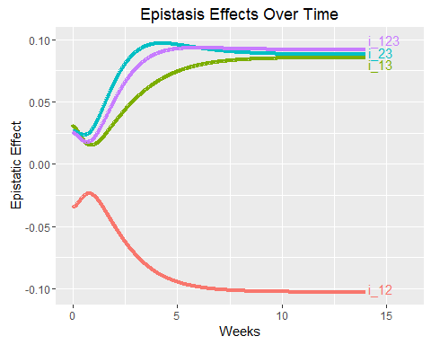</img>
  
$$i_{12}(t) = [(\mu_{111}(t) + \mu_{112}(t) + \mu_{221}(t) + \mu_{222}(t)) - (\mu_{121}(t) + \mu_{122}(t) + \mu_{211}(t) + \mu_{212}(t))]$$
$$i_{13}(t) =  [(\mu_{111}(t) + \mu_{121}(t) + \mu_{212}(t) + \mu_{222}(t)) - (\mu_{112}(t) + \mu_{122}(t) + \mu_{211}(t) + \mu_{221}(t))]$$
$$i_{23}(t) =  [(\mu_{111}(t) + \mu_{122}(t) + \mu_{211}(t) + \mu_{222}(t)) - (\mu_{112}(t) + \mu_{121}(t) + \mu_{212}(t) + \mu_{221}(t))]$$
$$i_{123}(t) =  [(\mu_{111}(t) + \mu_{122}(t) + \mu_{212}(t) + \mu_{122}(t)) - (\mu_{112}(t) + \mu_{121}(t) + \mu_{211}(t) + \mu_{222}(t))]$$

Mei Tree as Motivation
========================================================
type: exclaim

 - Previous results were from pre-fitted growth curves fit
 - Each parameter was then used as an individual response 
 - Want more efficient approach that uses all the information in the dataset
 - Need for a model with a functional response variable while using the iform procedure

Key Concepts
========================================================
type: exclaim

 - Regression as Linear Combination of Basis Functions
 - Legendre Polynomials to model genetic effect of each SNP over time
 - Generalized Least Squares for correlated errors (AR1 model assumed)

Generalized Least Squares
========================================================
type: exclaim

 - Unbiased
 - Consistent
 - Statistically and Computationally efficient
 - Asymptotically normal
 

Legendre Polynomials
========================================================
type: exclaim

 - Orthogonal and therefore predictors will not be correlated
 - Variety of polynomial fits
 - Easily implemented as basis functions 
  - saves on computational cost and time over using splines or other basis functions learned from the data

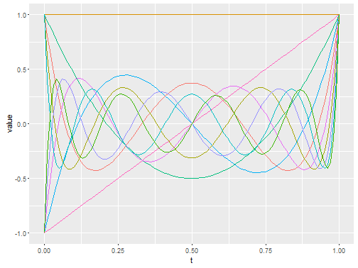

$$
\begin{equation}
\begin{split}
P_n(x) & = \frac{1}{2^n}\sum_{k=0}^{n}{{n}\choose{k}}^2(x-1)^{n-k}(x+1)^k \\
& = \sum_{k=0}^{n}{{n}\choose{k}}{{-n-1}\choose{k}}{\left(\frac{1-x}{2}\right)}^k \\
& = 2^{-n}\sum_{k=0}^{n} x^k {{n}\choose{k}}{{\frac{n+k+1}{2}}\choose{k}} \\
\end{split}
\end{equation}
$$

iForm with Legendre Polynomials Model
========================================================
type: exclaim

$$\alpha_j(t) = (L_0(t), L_1(t), ... , L_s(t))*(u_{j0}, u_{j1},...,u_{js})^T$$
$$\beta_j(t) = (L_0(t), L_1(t), ... , L_{s'}(t))*(v_{j0}, v_{j1},...,v_{js'})^T$$

$$
\begin{equation}
\begin{split}
y(t) = \mu(t) + \sum_{j=1}^{J}\alpha_j(t)\xi_j + \sum_{k=1}^{K}\beta_k(t)\zeta_k + \sum_{I_1 \lt I_2=1}^{I}\gamma_I^{aa}(t) \xi_{I_1}\xi_{I_2} \\ 
+ \sum_{I_1 \lt I_2=1}^{I}\gamma_I^{ad}(t) \xi_{I_1}\zeta_{I_2} + \sum_{I_1 \lt I_2=1}^{I} \gamma_I^{da}(t) \zeta_{I_1}\xi_{I_2} + \sum_{I_1 \lt I_2=1}^{I} \gamma_I^{dd}(t)\zeta_{I_1}\zeta_{I_2} + \epsilon(t)
\end{split}
\end{equation}
$$

$$\mu(t)=\frac{a}{(1+b*exp\{-r*t\})}$$

 Model (iForm with Legendre Model)
========================================================
type: exclaim

<small>
  - Step 1: (Initialization) 
  Set $\mathcal{S}^{(0)} = \emptyset$, $\mathcal{M}_0 = \emptyset$ and $\mathcal{C}_0 = \mathcal{P_1}$
  - Step 2: (Selection) In the kth step with given $\mathcal{S}^{(k-1)}$, $\mathcal{C}^{k−1}$ and $\mathcal{M}^{k−1}$, [forward regression](#/7) is used to select one more predictor from $\mathcal{C}^{k−1}/ \mathcal{S}^{k−1}$ into the model while checking for different degrees of the legendre polynomial used as a basis for the genetic effect. We add the selected one into $\mathcal{S}^{k−1}$ to get $\mathcal{S}^k$. We also update $\mathcal{C}^k$ and $\mathcal{M}^k$ if the newly selected predictor is a main effect. Otherwise, $\mathcal{C}^k = \mathcal{C}^{k−1}$ and $\mathcal{M}^k = \mathcal{M}^{k−1}$
  - Step 3: (Solution Path). Iterating Step 2, for D times, which leads to a total of D nested candidate models.  We then collect those models by a solution path $\mathbb{S}=\{\mathcal{S}^{(k)}: 1 \le k \le D\}$
</small>

Legendre Polynomials (Simulation)
========================================================
type: exclaim

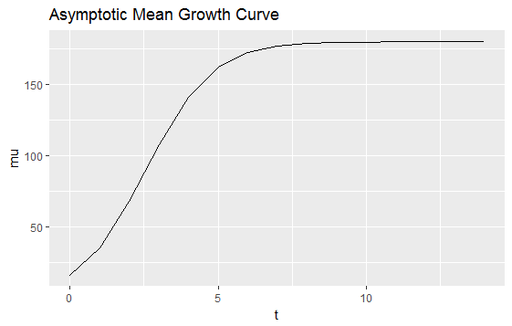 
<small>

|Model             | T1_tpr| T1_fpr| T2_tpr| T2_fpr|
|:-----------------|------:|------:|------:|------:|
|Model Predictors  | 1.0000| 0.1417| 1.0000| 0.0037|
|Polynomial Degree | 0.7125| 0.0251| 0.9667| 0.0007|
</small>

Legendre Polynomials (Simulation)
========================================================
type: exclaim

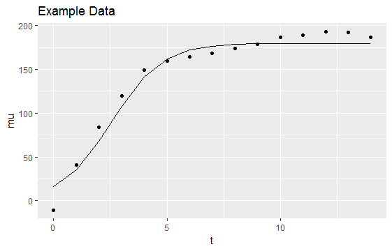 
<small>

|Model             | T1_tpr| T1_fpr| T2_tpr| T2_fpr|
|:-----------------|------:|------:|------:|------:|
|Model Predictors  | 1.0000| 0.1417| 1.0000| 0.0037|
|Polynomial Degree | 0.7125| 0.0251| 0.9667| 0.0007|
</small>

Legendre Polynomials (Simulation)
========================================================
type: exclaim

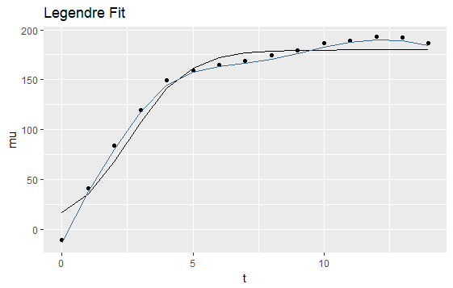 
<small>

|Model             | T1_tpr| T1_fpr| T2_tpr| T2_fpr|
|:-----------------|------:|------:|------:|------:|
|Model Predictors  | 1.0000| 0.1417| 1.0000| 0.0037|
|Polynomial Degree | 0.7125| 0.0251| 0.9667| 0.0007|
</small>

Application 2 (Mei Trees)
========================================================
type: exclaim

<small>

|Coefficient                                                      |  Estimate|       SE|  T.value| P.value|
|:----------------------------------------------------------------|---------:|--------:|--------:|-------:|
|mu_t                                                             |   0.98465| 0.014211| 69.28900|  0.0000|
|CATG_lm_ll_2801_a_P0                                             | -18.34603| 2.330582| -7.87187|  0.0000|
|CATG_lm_ll_2801_a_by_AATTC_lm_ll_2056_a_P0                       |  15.09978| 2.736415|  5.51809|  0.0000|
|CATG_lm_ll_2801_a_by_AATTC_nn_np_2246_a_P0                       |  17.44734| 2.589045|  6.73891|  0.0000|
|CATG_nn_np_3635_a_P0                                             |  35.64628| 2.457669| 14.50410|  0.0000|
|CATG_nn_np_3635_a_by_CATG_lm_ll_2637_a_P0                        | -20.86321| 2.162166| -9.64922|  0.0000|
|AATTC_lm_ll_2056_a_by_CATG_lm_ll_2801_a_by_CATG_nn_np_4200_a_P0  |  11.63512| 2.993626|  3.88663|  0.0001|
|AATTC_nn_np_2246_a_by_AATTC_nn_np_4205_a_by_CATG_lm_ll_2801_a_P0 | -22.10740| 3.305815| -6.68743|  0.0000|
|CATG_nn_np_3635_a_by_AATTC_nn_np_2292_a_P0                       | -16.84440| 2.092784| -8.04880|  0.0000|
|AATTC_hk_hk_753_d_P0                                             | -13.80524| 1.800741| -7.66642|  0.0000|
|AATTC_hk_hk_753_d_by_AATTC_hk_hk_485_a_P0                        |  18.90166| 2.076084|  9.10448|  0.0000|
|CATG_nn_np_3635_a_by_CATG_nn_np_3234_a_P0                        |  -7.26070| 2.454102| -2.95860|  0.0031|
|AATTC_hk_hk_753_d_by_CATG_nn_np_2208_a_P0                        |   7.81921| 2.288519|  3.41671|  0.0006|
|AATTC_hk_hk_485_a_by_AATTC_hk_hk_753_d_by_AATTC_nn_np_3611_a_P0  | -15.91187| 3.036233| -5.24066|  0.0000|
|CATG_lm_ll_2801_a_by_AATTC_nn_np_3395_a_P0                       | -13.76959| 2.301988| -5.98161|  0.0000|
|CATG_lm_ll_1732_a_P0                                             |  -8.98704| 2.578819| -3.48494|  0.0005|
|CATG_lm_ll_1732_a_by_AATTC_nn_np_4608_a_P0                       |  23.97652| 2.767672|  8.66307|  0.0000|
|AATTC_nn_np_4608_a_by_CATG_lm_ll_1732_a_by_CATG_nn_np_3543_a_P0  | -18.61259| 3.349466| -5.55688|  0.0000|
|CATG_lm_ll_789_a_by_CATG_nn_np_3234_a_by_CATG_nn_np_3635_a_P0    | -11.79580| 2.885184| -4.08840|  0.0000|
|CATG_lm_ll_1732_a_by_AATTC_lm_ll_2212_a_P0                       |   8.16593| 2.177668|  3.74985|  0.0002|
|CATG_lm_ll_1732_a_by_CATG_nn_np_2948_a_P0                        |   9.56873| 2.321721|  4.12139|  0.0000|
|AATTC_hk_hk_495_a_by_CATG_lm_ll_1732_a_by_CATG_nn_np_2948_a_P0   |  -8.64983| 2.183079| -3.96222|  0.0001|
|AATTC_nn_np_4608_a_by_CATG_lm_ll_1732_a_by_CATG_lm_ll_2787_a_P1  |  14.27351| 2.135087|  6.68521|  0.0000|
</small>

Application
========================================================
type: exclaim

 - Able to use all information to generate the model
 - Fit growth parameter of the specifed function during procedure
 - Found new epistatic effects that fitting only a single static response would not have found  
 
<small>
[Previous Results](#/28)
</small>

Conclusions
========================================================
type: exclaim

 - Sure Screening Properties
 - Computationally Efficient
 - Allows for flexible genetic effects 
    - Growth Curve
    - Correlated Error Structure
 - Tends to include more effects to obtain sure screening

Future Aims
========================================================
type: exclaim
<small>
 - Aim 1
   - Continue testing properties of the iForm procedure used with the Legendre Polynomials
   - Submit by Summer

 - Aim 2
   - Consider other multivariate responses and correlated error structures.  
   - Expression levels of different cell lines or tissue types as multivariate response 

 - Aim 3
  - Combine functional component and multivariate response into complete functional network
    - Time-Series of gene expression from cell lines or tissue types
</small>

References
========================================================
type: exclaim

 - Taylor and Ehrenreich 2014
 - Lim and Hastie 2014
 - Bien et al 2013
 - Wang 2012
 - Wang and Leng 2015
 - Fan and Lv 2008
 - Rockman et al 2010
 - Pearson, 2006
 - Kim et al. 2014
 - Fairfax et al. 2014
 - Lee et al. 2014
 - Emilsson et al. 2008
 - Cookson et al. 2009
 
***
 
 - Nica and Dermitzakis 2013
 - Kendziorski et al. 2006
 - Chun and Keles 2009
 - Sun 2012;
 - Flutre et al. 2013
 - Li et al. 2013
 - Cheverud and Routman 1995 
 - Moore 2003
 - van Eeuwijk et al. 2010
 - Mackay 2014
 - Wu et al. 2007
 - Hao and Zhang 2014

Acknowledgments
========================================================
type: exclaim

 - Family
 - Advisor: Rongling Wu
 - Committee
   - Vern Chinchilli
   - Lan Kong
   - James Broach
 - PHS Faculty
 - Nursing Department

Thank you
========================================================
type: exclaim
